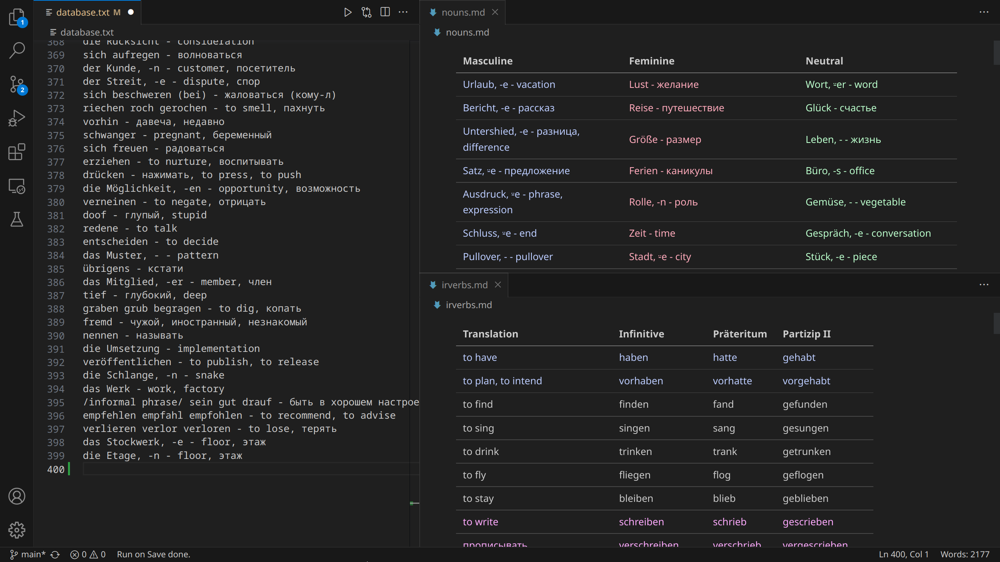

# Language Workspace for Studying
Workspace settings for language studing German



## Features

- Automatically generates (on save) and renders table for nouns by gender
- Automatically generates (on save) and renders table for irrefular verbs (with auto-detection of ir.verbs)
- Widget for Linux that loops through the words

## Requirements

#### Workspace
- Linux
- Visual studio code
- emeraldwalk.runonsave extension
- amodio.restore-editors extension
- settings as [settings.json](https://github.com/AnanasikDev/LanguageWorkspace/blob/main/settings.json) (adjust path)

When you leave your folder, VSCode saves the layout for you automatically, so if you need a specific layout only in one folder (for studying a language for example), it is easy to leave it by default.

As this workspace configures Markdown files (for tables), it is important to get them load automatically. It is impossible to do if you leave standard markdown previews. However, right-clicking on the file and then ```"Reopen Editor with..."``` and choose  ```"Markdown Preview"``` makes the desired Markdown file to be automatically rendered as preview.

*(the actual problem in basic previews is that they are temporary rendering canvases rather than files, therefore non of the editor-layout restoring extensions or internal feature can restore them properly. Another annoying issue is that standard previews capture last focused file if they are not toggled intensionally. ```"Toggle Preview Locking"``` solves the issue, but it is rather inconvenient to do so. That tip solves both issues by turning a file into a preview)*

#### Widget

- Command Output Widget (built-in in Kubuntu) 

Command: set command to ```python3 {path}.py```

On Click Command (optional): ```python3 {path}.py```

## Customisation

bool: COLORIFY (True by default)<br>
bool: showNounsArticles (False by default)

## Known issues and restrictions

- Only German language is supported by default (auto-detection of nouns and irregular verbs)
- Customisation values are only accessible from the python script
- Widget is available only for Linux

## Future improvements

- Toggle show plural forms of nouns
- Table for plural forms of nouns
